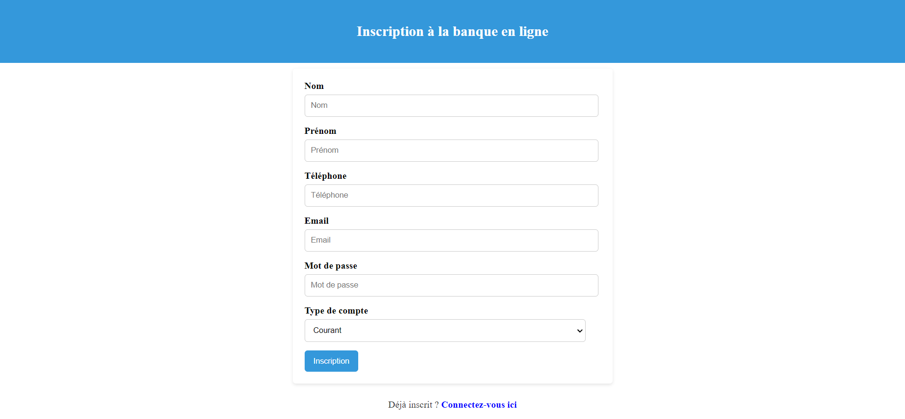
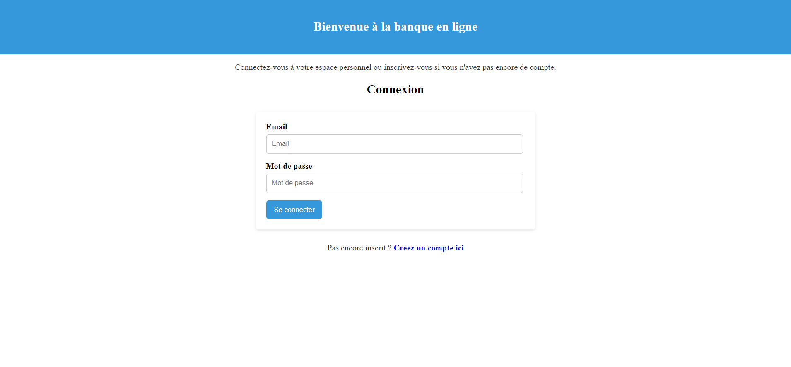
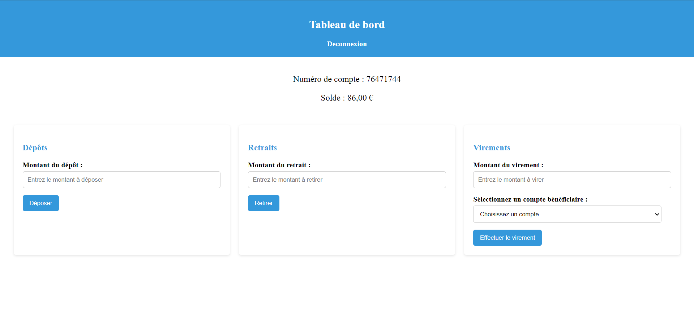

## PHP and JavaScript project
### Project Purpose
Create a secure application for managing bank accounts.

### Prerequisites
- php
- Javascript
- html/css

### Launch the project 
```php -S localhost:8080```

### Database
- The application is powered by a remote database server.
- Add the database credentials in php-validation/db.php

### Application Functionality
The application is designed to provide users with a secure and user-friendly interface for managing their bank accounts. Here’s an overview of how the application works:

#### Registration
When a user registers, a unique account number is automaticaly assigned to them. This account number consists of 8 digits and serves to uniquely identify each user in the database. The registration process requires basic information such as the user's name, email address, and a secure password.



#### Login
Once registered, the user can log into the application using their email address and password. The login process is secured by an authentication mechanism that verifies the user's credentials.



#### Available Operations
After logging in, the user can perform several operations on their account:



- Deposit:

The user can add funds to their account by specifying the amount to deposit. The application updates the account balance in real time and records the transaction in the transaction history.
Withdrawal:

- The user can withdraw funds from their account. They need to specify the amount to withdraw, and the application checks that there are sufficient funds to perform the transaction. If the balance is insufficient, an error message is displayed.
Transfer:

- The user can transfer funds to another account. They must enter the recipient's account number and the amount to be transferred. The application validates the account number and processes the transfer by updating the balances of both accounts involved.
Security
The application employs several security measures to protect user data, including:

- Password Encryption: Passwords are securely stored in the database using hashing algorithms.
Input Validation: All user input is validated to prevent SQL injection attacks and other vulnerabilities.
Secure Sessions: User sessions are managed securely to prevent session hijacking.